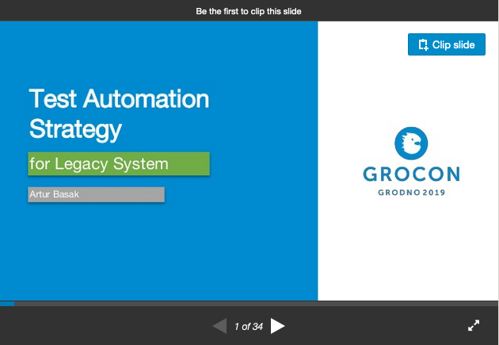

### GROCON'19: Test Automation Strategy for Legacy System

Часто бывает ситуация, когда приходишь на проект и обнаруживаешь, что в кодовой базе абсолютно отсутствуют хоть какие-то автоматические тесты.

В этом случае перед разработчиком стоит задача не только доработать систему и внести в нее изменения, но и умудриться не сломать существующий функционал.

Тесты могли бы определенно помочь в этом нелегком деле. Но с чего начать? Какую стратегию для этого выбрать? Как начать писать тесты в легаси-системе? Как убедить в этом заказчика? Как убедить и обучить сторонних разработчиков, которые никогда до этого не писали тесты, в том что это необходимо?

Я бы хотел поделиться таким опытом на примере реального проекта, разработкой которого я занимался последние 2 года - Lition Energy.

[https://www.lition.de](https://www.lition.de)